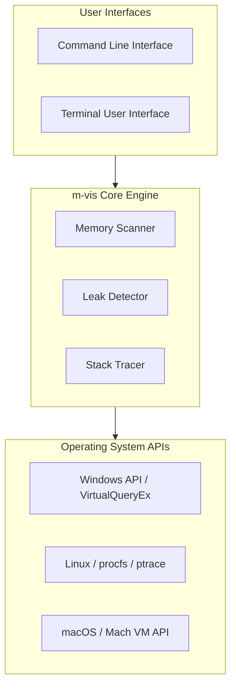
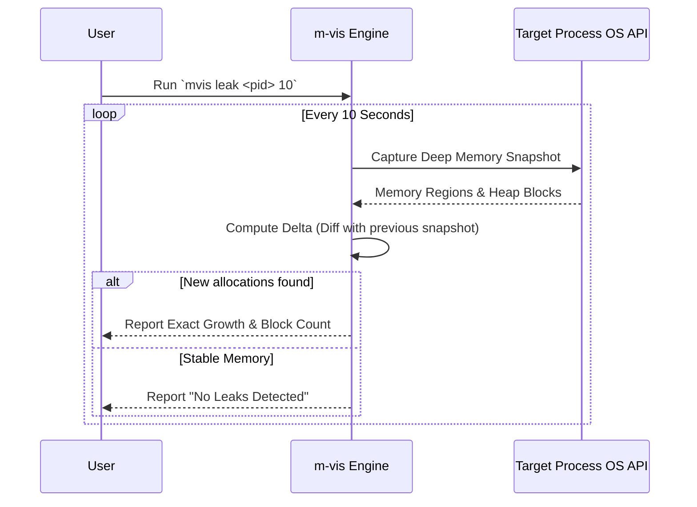

# m-vis: Memory Debugging Made Simple 🧠

[](https://github.com/SickleFire/m-vis/actions/workflows/tests.yml)
[](https://opensource.org/licenses/MIT)

Welcome to **m-vis**. Memory debugging for developers who just want answers. Simple. Fast. Works everywhere.

Existing tools are either platform specific (Valgrind, WinDbg) or too complex for quick diagnostics. m-vis gives you deep memory insights with a single command across any platform.

Our design philosophy is built around simplicity and accessibility because **we believe memory debugging should be accessible, not a PhD requirement.**

**"One command. All platforms. No configuration hell."**

---

## 🏗 System Architecture

m-vis is built in Rust to provide native, blazing fast performance without overhead. It abstracts away the complex OS level memory APIs into a unified, cross platform scanning engine.



---

## 🚀 Quick Start

### 1. Installation
The fastest way to get started is downloading a pre built binary from the [Releases](https://github.com/SickleFire/m-vis/releases) page.
If you have Rust installed, you can build from source:
```bash
git clone https://github.com/SickleFire/m-vis
cd mvis
cargo build --release
# Your binary is at target/release/mvis
```

### 2. Enter the TUI
Experience the interactive memory dashboard immediately:
```bash
mvis tui
```


### 3. Basic CLI Commands
```bash
# Find a target process
mvis list

# Scan process memory maps (replace 'notepad' with your target)
mvis scan notepad -a

# Monitor a process for memory leaks (10 second interval)
mvis leak notepad 10
```

---

## 🎨 Features & Capabilities

- **Process Scanning**: Inspect memory allocations, mapped regions, and permissions of active processes.
- **Heap Level Analysis**: Dive deeply into heap structures and allocations for detailed debugging.
- **DLL Tracking**: Monitor and list all dynamic libraries (DLLs/SOs/Dylibs) loaded by a target.
- **Real time Memory Leak Detection**: Identify and monitor processes with growing, unreleased memory allocations.
- **Leak Delta Chart**: m-vis includes a real time leak delta chart that visualizes memory allocation trends over time directly in the TUI.
- **Universal OS Support**: 100% native support for Windows, Linux, and macOS.

---

## 🔄 Core Workflows: How Leak Detection Works

The leak detector doesn't just watch total RAM usage; it takes deep topological snapshots of the process heap and computes exact block level deltas to find silent unreleased memory.



---

## 🔐 macOS Security & Code Signing

On macOS, `mvis` requires the `com.apple.security.cs.debugger` entitlement to inspect other processes due to Hardened Runtime restrictions. Even with `sudo`, inspecting third party apps requires this entitlement.

To build and run `mvis` on macOS:
```bash
# We provide a Makefile that automatically builds and signs the binary ad-hoc
make build

# To run a scan using the Makefile helper:
make run-scan PROCESS=language_server_macos_arm MODE=-a
```
*Note: Apple platform apps (Safari, Finder) and some Hardened Runtime apps (WhatsApp) will remain protected by System Integrity Protection (SIP) even with this entitlement.*

---

## 💻 Detailed Usage & Examples

### Available Commands
```powershell
# visualize memory map
mvis scan notepad.exe -a

# heap stats
mvis scan notepad.exe -h

# detect leaks
mvis leak notepad.exe 10

# multi sample leak detection
mvis leak-m notepad.exe 10 3

# list processes
mvis list

# open mvis tui
mvis tui
```

### Visual Examples

**Detecting Leaks:**
```powershell
mvis leak leaking_app.exe 10
```
Output: <br>
 <br>

**Scanning Process Maps:**
```powershell
mvis scan myapp.exe -a
```
Output: <br>

<br>


---

## 🛠 Developer Commands & Testing

The project includes comprehensive unit and integration tests to ensure reliability across platforms.

### Run all tests
```bash
cargo test
```

### Run only integration tests
```bash
cargo test --test integration_tests
```

### Run integration tests with elevated privileges
```bash
# On Linux with sudo
sudo cargo test --test integration_tests -- --include-ignored

# On Windows (run terminal as Administrator)
cargo test --test integration_tests -- --include-ignored
```

---

## 📅 Status & Roadmap
Early but highly functional. Core scanning and leak detection work on all supported platforms. 
See the [Roadmap](https://github.com/SickleFire/m-vis/issues/24) for what's coming next.

## 📄 License
MIT — see [LICENSE](LICENSE.md)
